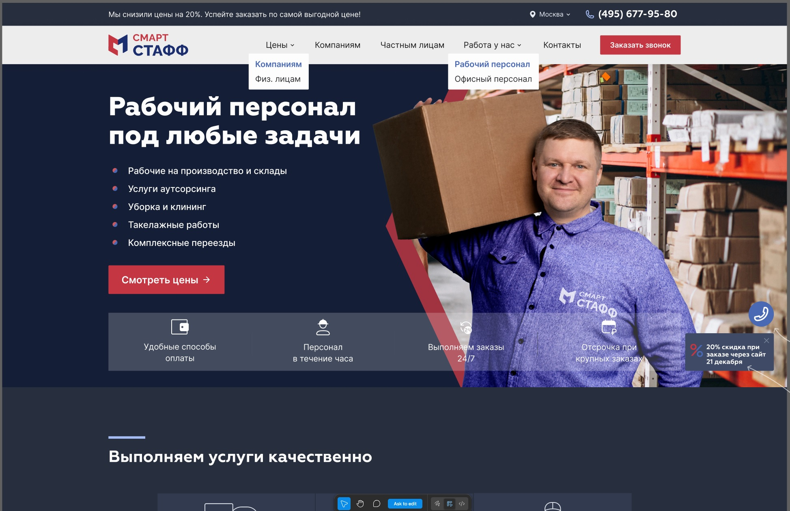

# 🚀 Рабочий персонал

Современное SPA-приложение, реализованное на React с использованием архитектуры (FSD).  
Проект ориентирован на масштабируемость, переиспользуемость и чистую архитектуру.

## 🚀 Макет

  

## 📖 О проекте

Приложение демонстрирует:

- Реализацию архитектуры FSD
- Централизованную систему стилей
- Кастомный ErrorBoundary
- Страницу 404 с автоматическим редиректом
- Mobile-first адаптивную вёрстку
- Плавную типографику через `clamp()`

Проект создан как демонстрация production-подхода к организации фронтенд-приложения.

## 🛠 Технологический стек

- React 18
- TypeScript
- Vite
- React Router
- SCSS (Sass)
- Feature-Sliced Design

## 🚀 Установка и запуск

Клонировать репозиторий:

git clone <repo-url>

Установить зависимости:

npm install

Запуск в dev режиме:

npm run dev

Сборка:

npm run build
